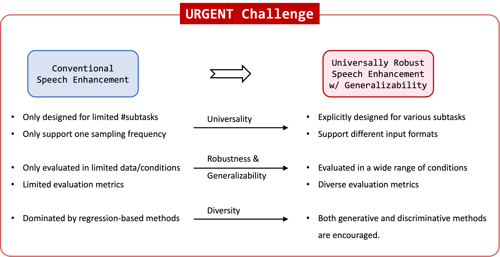

<!--  -->

# URGENT Challenge: Universality, Robustness, and Generalizability for EnhancemeNT
<!-- ## Special session at [Interspeech 2024](https://www.interspeech2024.org)  -->

### Background

Recent decades have witnessed rapid development of deep learning-based speech enhancement (SE) techniques, with impressive performance in matched conditions. However, most conventional speech enhancement approaches focus only on a limited range of conditions, such as single-channel, multi-channel, anechoic, and so on.

In many existing works, researchers tend to only train SE models on one or two common datasets, such as the VoiceBank+DEMAND and DNS datasets. The evaluation is often done only on simulated conditions that are similar to the training setting. Meanwhile, in earlier SE challenges such DNS series, the choice of training data was also often left to the participants. This led to the situation that models trained with a huge amount of private data were compared to models trained with a small public dataset. This greatly impedes understanding of the generalizability and robustness of SE methods comprehensively. In addition, the model design may be biased towards a specific limited condition if only a small amount of data is used. The resultant SE model may also have limited capacity to handle more complicated scenarios.

Apart from conventional discriminative methods, generative methods have also attracted much attention in recent years. They are good at handling different distortions with a single model [1-2] and tend to generalize better than discriminative methods [3]. However, their capability and universality have not yet been fully understood through a comprehensive benchmark.

Meanwhile, recent efforts [4] have shown the possibility of building a single system to handle various input formats, such as different sampling frequencies and numbers of microphones. However, there lacks a well-established benchmark covering a wide range of conditions, and no systematic comparison has been made between state-of-the-art (SOTA) discriminative and generative methods regarding their generalizability.

Existing speech enhancement challenges have fostered the development of speech enhancement models for specific conditions, such as denoising and dereverberation [5-9], speech restoration [9], packet loss concealment [11], acoustic echo cancellation [12-14], hearing aid [15-16], 3D speech enhancement [17-18], far-field multi-channel speech enhancement for video conferencing [19], and unsupervised domain adaptation for denoising [20]. These challenges have greatly enriched the corpora in speech enhancement studies. However, there still lacks a challenge that can benchmark the generalizability of speech enhancement systems in a wide range of conditions.

Similar issues can also be observed in other speech tasks such as automatic speech recognition (ASR), speech translation (ST), speaker verification (SV), and spoken language understanding (SLU). Among them, speech enhancement is particularly vulnerable to mismatches since it is heavily reliant on paired clean/noisy speech data to achieve strong performance. Unsupervised speech enhancement that does not require groundtruth clean speech has been proposed to address this issue, but often merely brings benefit in a final finetuning stage [21]. Therefore, we focus on speech enhancement in this challenge to address the aforementioned problems.

### Goal

Based on the increasing interest in the generalizability of speech enhancement models, we propose the URGENT challenge that aims to:
1. Bring more attention to constructing universal speech enhancement models with strong generalizability.
2. Push forward the progress of speech enhancement research towards more realistic scenarios with a comprehensive evaluation.
3. Provide insightful and systematic comparison between SOTA discriminative and generative methods in a wide range of conditions, including different distortions and input formats (sampling frequencies and number of microphones).
4. Provide a benchmark for this direction so that researchers can easily compare different methods.
5. Allow conclusiveness of method comparisons by providing a set of training data that is exclusive and mandatory for all models.

### Task

The task is to build **a single speech enhancement system** to adaptively handle input speech with different distortions (corresponding to different SE subtasks) and different input formats (e.g., sampling frequencies) in different acoustic environments.

The training data will consist of several public corpora of speech, noise, and RIRs. Only the specified set of data can be used during the challenge. We encourage participants to apply data augmentation techniques such as synamic mixing to achieve the best generalizability. The data preparation scripts will be released soon in our GitHub repository https://github.com/urgent-challenge/urgent2024_challenge/.

We will provide baselines (both regression-based and generative) for the challenge. The alpha version with multi-task support will be released soon for early development. A better-tuned beta version will be available later on.

We will evaluate models with a variety of metrics to comprehensively understand the capacity of existing generative and discriminative methods. Tentative metrics include:
* non-intrusive metrics (e.g., DNSMOS, NISQA) for reference-free speech quality evaluation.
* intrusive metrics (e.g., PESQ, STOI, SDR, MCD, VISQOL) and non-intrusive metrics (e.g., DNSMOS, NISQA) for objective speech quality evaluation.
* intrusive metrics (e.g., phone accuracy, Levenshtein phone distance or similarity) for language-independent, speaker-independent, and downstream task-independent evaluation of phonetic fidelity.
* automatic metrics (e.g., speaker similarity, WER) for evaluation of compatibility with different downstream tasks.

More details about the data and evaluation plan will be released soon.

### Paper submission

Papers submitted to the session should follow the regular Interspeech paper guidelines, [submission](https://www.interspeech2024.org/paper-submission/) and review process.    
Accepted papers will appear in the main proceedings and the ISCA archive.   
Be sure to list "URGENT Challenge: Universality, Robustness, and Generalizability for EnhancemeNT" as your paper subject area when making a submission. 

**Papers must be submitted by 2 March 2024, but updates are permitted up until 9 March 2024. All dates are Anywhere over Earth (AoE)**

### Organizing team

> The current list is tentative and will be finalized later.

**Core members**
* Wangyou Zhang, Shanghai Jiao Tong University, China
* Robin Scheibler, LINE Corp., Japan
* Samuele Cornell, Carnegie Mellon University, USA
* Chenda Li, Shanghai Jiao Tong University, China
* Kohei Saijo, Waseda University, Japan
* Shinji Watanabe, Carnegie Mellon University, USA
* Tim Fingscheidt, Technische Universität Braunschweig, Germany
* Zhaoheng Ni, Meta, USA

**Advisory members**
* Yanmin Qian, Shanghai Jiao Tong University, China
* Zhong-Qiu Wang, Carnegie Mellon University, USA
* Jonathan Le Roux, MERL, USA
* Nicholas J. Bryan, Adobe, USA
* Shoko Araki, NTT, Japan

### Contact

For any further question drop an email to: [urgent.challenge@gmail.com](mailto:urgent.challenge@gmail.com)

### References

[1] J. Serrà, S. Pascual, J. Pons, R. O. Araz, and D. Scaini, “[Universal speech enhancement with score-based diffusion](https://arxiv.org/abs/2206.03065),” arXiv preprint arXiv:2206.03065, 2022.

[2] H. Liu, X. Liu, Q. Kong, Q. Tian, Y. Zhao, D. Wang, C. Huang, and Y. Wang, “[VoiceFixer: A unified framework for high-fidelity speech restoration](https://isca-speech.org/archive/interspeech_2022/liu22y_interspeech.html),” in Proc. ISCA Interspeech, 2022, pp. 4232–4236.

[3] Y.-J. Lu, Z.-Q. Wang, S. Watanabe, A. Richard, C. Yu, and Y. Tsao, “[Conditional diffusion probabilistic model for speech enhancement](https://arxiv.org/abs/2202.05256),” in Proc. IEEE ICASSP, 2022, pp. 7402–7406.

[4] W. Zhang, K. Saijo, Z.-Q. Wang, S. Watanabe, and Y. Qian, “[Toward universal speech enhancement for diverse input conditions](https://arxiv.org/abs/2206.03065),” in Proc. IEEE ASRU, 2023, arXiv:2309.17384.

[5] C. K. Reddy, V. Gopal, R. Cutler, E. Beyrami, R. Cheng, H. Dubey, S. Matusevych, R. Aichner, A. Aazami, S. Braun, P. Rana, S. Srinivasan, and J. Gehrke, “[The INTERSPEECH 2020 deep noise suppression challenge: Datasets, subjective testing framework, and challenge results](https://isca-speech.org/archive/interspeech_2020/reddy20_interspeech.html),” in Proc. ISCA Interspeech, 2020, pp. 2492–2496.

[6] C. K. Reddy, H. Dubey, V. Gopal, R. Cutler, S. Braun, H. Gamper, R. Aichner, and S. Srinivasan, “[ICASSP 2021 deep noise suppression challenge](https://arxiv.org/abs/2009.06122),” in Proc. IEEE ICASSP, 2021, pp. 6623–6627.

[7] C. K. Reddy, H. Dubey, K. Koishida, A. Nair, V. Gopal, R. Cutler, S. Braun, H. Gamper, R. Aichner, and S. Srinivasan, “[INTERSPEECH 2021 deep noise suppression challenge](https://isca-speech.org/archive/interspeech_2021/reddy21_interspeech.html),” in Proc. ISCA Interspeech, 2021, pp. 2796–2800.

[8] H. Dubey, V. Gopal, R. Cutler, A. Aazami, S. Matusevych, S. Braun, S. E. Eskimez, M. Thakker, T. Yoshioka, H. Gamper, and R. Aichner, “[ICASSP 2022 deep noise suppression challenge](https://arxiv.org/abs/2202.13288),” in Proc. IEEE ICASSP, 2022, pp. 9271–9275.

[9] H. Dubey, A. Aazami, V. Gopal, B. Naderi, S. Braun, R. Cutler, A. Ju, M. Zohourian, M. Tang, H. Gamper, M. Golestaneh, and R. Aichner, “[ICASSP 2023 deep speech enhancement challenge](https://arxiv.org/abs/2303.11510),” arXiv preprint arXiv:2303.11510, 2023.

[10] R. Cutler, A. Saabas, B. Naderi, N.-C. Ristea, S. Braun, and S. Branets, “[ICASSP 2023 speech signal improvement challenge](https://arxiv.org/abs/2303.06566),” arXiv preprint arXiv:2303.06566, 2023.

[11] L. Diener, S. Sootla, S. Branets, A. Saabas, R. Aichner, and R. Cutler, “[INTERSPEECH 2022 audio deep packet loss concealment challenge](https://isca-speech.org/archive/interspeech_2022/diener22_interspeech.html),” in Proc. ISCA Interspeech, 2022, pp. 580–584.

[12]  R. Cutler, A. Saabas, T. Parnamaa, M. Loide, S. Sootla, M. Purin, H. Gamper, S. Braun, K. Sorensen, R. Aichner, and S. Srinivasan, “[INTERSPEECH 2021 acoustic echo cancellation challenge](https://isca-speech.org/archive/interspeech_2021/cutler21_interspeech.html),” in Proc. ISCA Interspeech, 2021, pp. 4748–4752.

[13] K. Sridhar, R. Cutler, A. Saabas, T. Parnamaa, M. Loide, H. Gamper, S. Braun, R. Aichner, and S. Srinivasan, “[ICASSP 2021 acoustic echo cancellation challenge: Datasets, testing framework, and results](https://ieeexplore.ieee.org/document/9413457),” in Proc. IEEE ICASSP, 2021, pp. 151–155.

[14] R. Cutler, A. Saabas, T. Parnamaa, M. Purin, H. Gamper, S. Braun, K. Sørensen, and R. Aichner, “[ICASSP 2022 acoustic echo cancellation challenge](https://arxiv.org/abs/2202.13290),” in Proc. IEEE ICASSP, 2022, pp. 9107–9111.

[15] S. Graetzer, J. Barker, T. J. Cox, M. Akeroyd, J. F. Culling, G. Naylor, E. Porter, and R. V. Muñoz, “[Clarity-2021 challenges: Machine learning challenges for advancing hearing aid processing](https://isca-speech.org/archive/interspeech_2021/graetzer21_interspeech.html),” in Proc. ISCA Interspeech, 2021, pp. 686–690.

[16] M. A. Akeroyd, W. Bailey, J. Barker, T. J. Cox, J. F. Culling, S. Graetzer, G. Naylor, Z. Podwi'nska, and Z. Tu, “[The 2nd Clarity enhancement challenge for hearing aid speech intelligibility enhancement: Overview and outcomes](https://ieeexplore.ieee.org/document/10094918),” in Proc. IEEE ICASSP, 2023.

[17] E. Guizzo, R. F. Gramaccioni, S. Jamili, C. Marinoni, E. Massaro, C. Medaglia, G. Nachira, L. Nucciarelli, L. Paglialunga, M. Pennese, S. Pepe, E. Rocchi, A. Uncini, and D. Comminiello, “[L3DAS21 challenge: Machine learning for 3D audio signal processing](https://ieeexplore.ieee.org/document/9596248),” in Proc. International Workshop on Machine Learning for Signal Processing (MLSP), 2021, pp. 1–6.

[18] E. Guizzo, C. Marinoni, M. Pennese, X. Ren, X. Zheng, C. Zhang, B. Masiero, A. Uncini, and D. Comminiello, “[L3DAS22 challenge: Learning 3D audio sources in a real office environment](https://arxiv.org/abs/2202.10372),” in Proc. IEEE ICASSP, 2022, pp. 9186–9190.

[19] W. Rao, Y. Fu, Y. Hu, X. Xu, Y. Jv, J. Han, Z. Jiang, L. Xie, Y. Wang, S. Watanabe, Z.-H. Tan, H. Bu, T. Yu, and S. Shang, “[ConferencingSpeech challenge: Towards far-field multi-channel speech enhancement for video conferencing](https://ieeexplore.ieee.org/document/9688126),” in Proc. IEEE ASRU, 2021, pp. 679–686.

[20] S. Leglaive, L. Borne, E. Tzinis, M. Sadeghi, M. Fraticelli, S. Wisdom, M. Pariente, D. Pressnitzer, and J. R. Hershey, “[The CHiME-7 UDASE task: Unsupervised domain adaptation for conversational speech enhancement](https://arxiv.org/abs/2307.03533),” in Proc. 7th International Workshop on Speech Processing in Everyday Environments (CHiME), 2023.

[21] Z. Xu, M. Sach, J. Pirklbauer, T. Fingscheidt, “[Employing Real Training Data for Deep Noise Suppression](https://arxiv.org/abs/2309.02432),” accepted by ICASSP 2024, arXiv:2309.02432.
